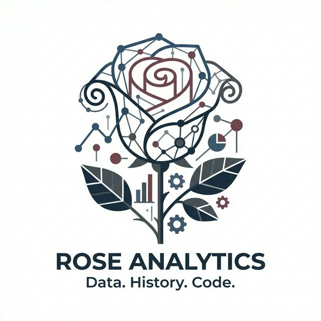
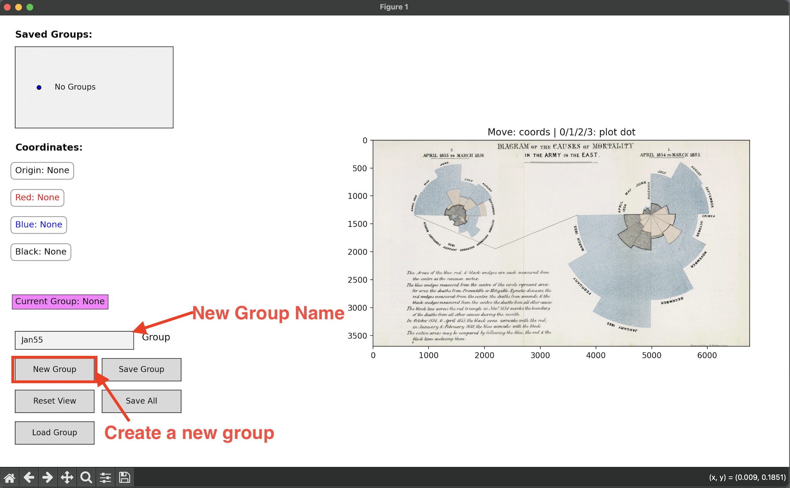
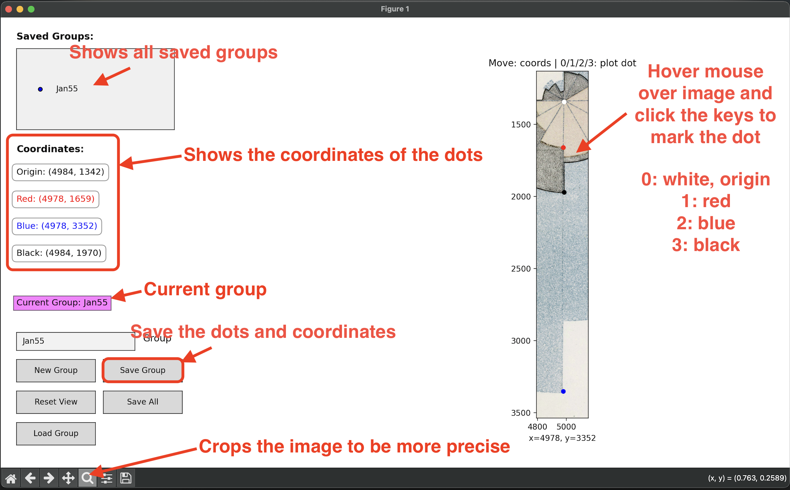
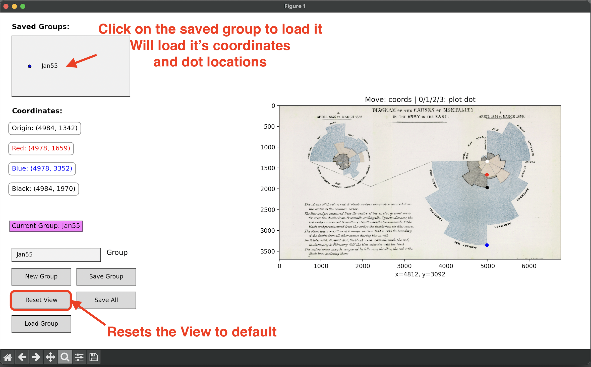
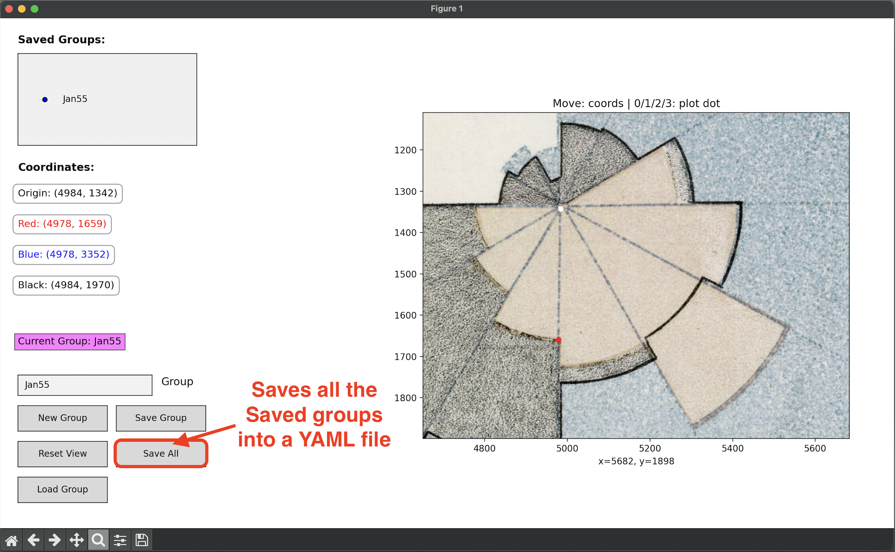
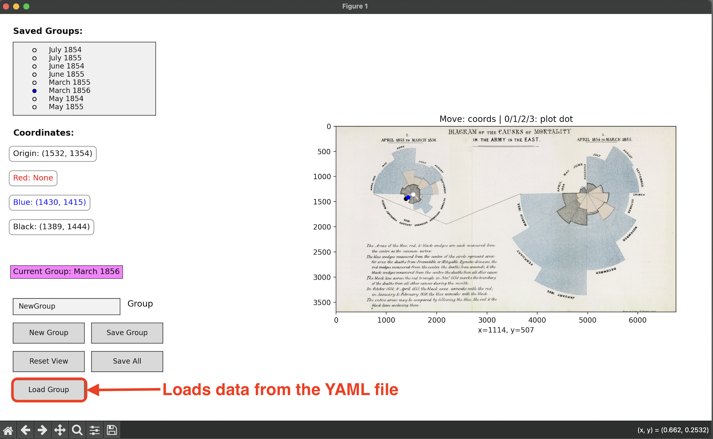

# Florence Nightingale's Rose Diagram — A Replication

## The Story

This project is a modern replication of Florence Nightingale's famous 'Rose Diagram', which vividly illustrated the causes of deaths during the Crimean War. By developing a custom application to digitize the original historical charts, we extracted raw coordinate data and turned it into proportional radii and areas. This allows for us to programmatically recreate the visualization using Python, demonstrating the profound impact of Nightingale's data visualization for public health policies.

## How the Data Was Collected

To accurately digitize Florence Nightingale's original charts, we built a custom Image Coordinate Viewer application using Python and Matplotlib (`src/image_coords.py`). This interactive tool loads the historical "Nightingale.png" image and allows the user to click and log specific pixel coordinates for the origin, along with the radial boundaries of the red, blue, and black wedges for each month. The application then saves these carefully plotted coordinates into a structured `groups.yaml` file, categorizing them by thematic names, which lays the groundwork for computing the proportional radii and areas needed to reconstruct the diagram.

## The Math and Visualization

- **Radius Calculations**: We calculate the distances from the origin to the colored coordinates (red, blue, and black) for each month using the standard Euclidean distance formula. These measurements serve as the radii ($r$) for each respective wedge.
- **Area Proportions**: Because Nightingale designed the visual impact to be proportional to area (rather than just radius, $r^2$), we compute the area of a full circle using these radii and divide by 12 to capture the area of exactly one month's wedge.
- **Color Encodings**: Each resulting wedge visually encodes deaths from different causes (preventable diseases, wounds, and all other causes), maintaining the power of Nightingale's original graphic.

## The Visualization

## Key Insights

- **Pre-Reform Devastation**: The right-hand diagram (April 1854 – March 1855) overwhelmingly illustrates that the vast majority of deaths were caused by preventable diseases (the massive blue/grey areas) rather than direct battlefield wounds.
- **Impact of Reforms**: The left-hand diagram (April 1855 – March 1856) shows a dramatic reduction in the overall size of the wedges—especially the blue/grey sections—following the implementation of sanitary improvements by the Sanitary Commission.
- **The Power of Data Visualization**: Nightingale’s diagram proved that statistics could be used not just for record-keeping, but as a compelling visual argument to drive real-world policy change and save lives.
- **Visual Impact**: Representing the data by area rather than just radius (length) amplifies the perceived difference between the high-mortality and low-mortality periods in a way a standard bar chart cannot capture.

## Technical Details

- **Language**: Python  
- **Libraries**: `matplotlib`, `numpy`, `PyYAML`
- **Files**:
  - `src/image_coords.py`: The main Matplotlib-based GUI app for logging coordinates.
  - `output/groups.yaml`: The persistent storage file for our collected coordinates.
  - `assets/Nightingale.png`: The original historical image used for digitization.

## How to Run

1. Clone this repository.  
2. Create and activate a virtual environment (optional but recommended).  
3. Install the required dependencies:  
   `pip install -r requirements.txt`  
4. Run the coordinate viewer application:  
   `python src/image_coords.py`  

## What I Learned

I learned how to use matplotlib to create a GUI application for collecting data from an image. I also learned how to use yaml to store data in a structured format. And also learned how to use numpy to calculate the area of a circle and use matplotlib to create a rose diagram.

## Visual Walkthrough

 
 
 
 
 

## License

This project is licensed under the [MIT License](LICENSE) - see the [LICENSE](LICENSE) file for details.

